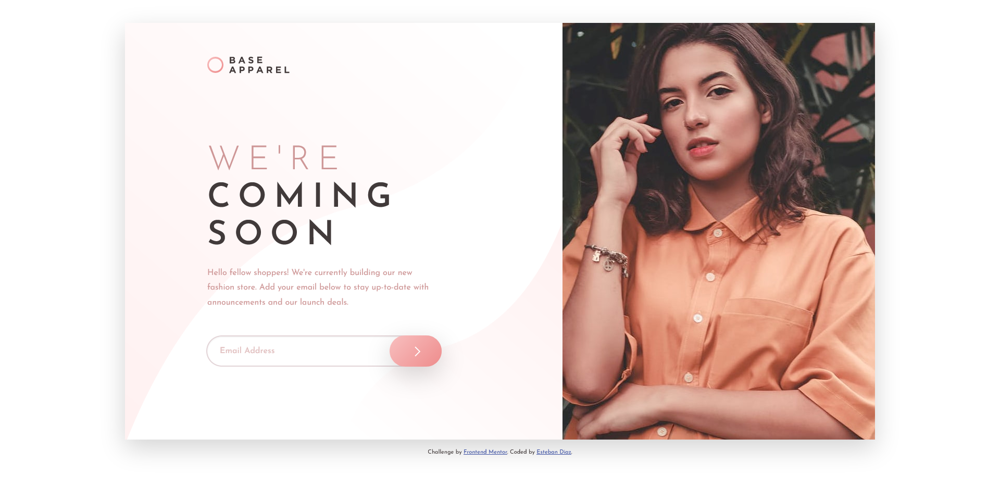

# Frontend Mentor - Base Apparel coming soon page solution

This is a solution to the [Base Apparel coming soon page challenge on Frontend Mentor](https://www.frontendmentor.io/challenges/base-apparel-coming-soon-page-5d46b47f8db8a7063f9331a0). Frontend Mentor challenges help you improve your coding skills by building realistic projects. 

## Table of contents

- [Overview](#overview)
  - [The challenge](#the-challenge)
  - [Screenshot](#screenshot)
  - [Links](#links)
- [My process](#my-process)
  - [Built with](#built-with)
  - [What I learned](#what-i-learned)
  - [Continued development](#continued-development)
  - [Useful resources](#useful-resources)
- [Author](#author)
- [Acknowledgments](#acknowledgments)

**Note: Delete this note and update the table of contents based on what sections you keep.**

## Overview

### The challenge

Users should be able to:

- View the optimal layout for the site depending on their device's screen size
- See hover states for all interactive elements on the page
- Receive an error message when the `form` is submitted if:
  - The `input` field is empty
  - The email address is not formatted correctly

### Screenshot



### Links

- Solution URL: [Add solution URL here](https://your-solution-url.com)
- Live Site URL: [Add live site URL here](https://infallible-kilby-4e1377.netlify.app)

## My process

### Built with

- Semantic HTML5 markup
- CSS custom properties
- Flexbox
- [Bootstrap 5 ](https://getbootstrap.com/) - CSS library
- [Sass](https://sass-lang.com/) - CSS extension language

### What I learned

I learned how you can custom bootstrap 5 with sass, i had change variable sass from bootstrap 5.

To see how you can custom the fonts:

```css
  $font-family-base: 'Josefin Sans', sans-serif;
```

### Continued development

I want to continue focusing in a proyect react JS. going forward building a proyect from react. 

### Useful resources


## Author

- Frontend Mentor - [@esteban2368](https://www.frontendmentor.io/profile/esteban2368)

